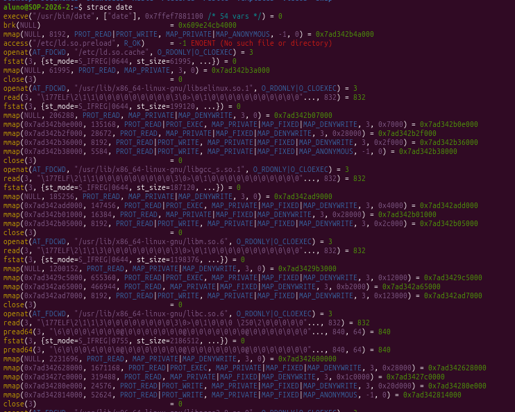
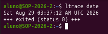
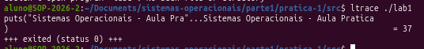
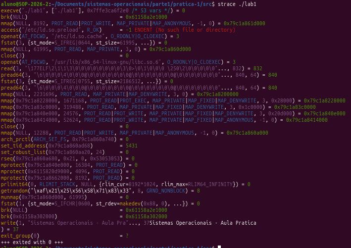

# Experimento 1
1. O utilitário strace do UNIX permite observar a sequência de chamadas de sistema efetuadas por uma aplicação. Em um terminal, execute strace date para descobrir quais os arquivos abertos pela execução do utilitário date (que indica a data e hora correntes). Por que o utilitário date precisa fazer chamadas de sistema?

- Sendo o Date um programa utilitário, pertencente à camada do Usuário/aplicações, ele não tem permissão para gerenciar o relógio do hardware. Quem faz isso é o núcleo do SO. Para ter acesso à essa informação, o Date precisa fazer um "pedido" ao núcleo por meio de algumas funções. Exemplo: execve(), brk(), read(), mmap(), close() que pode ser observadas em 

    

2. O utilitário ltrace do UNIX permite observar a sequência de chamadas de biblioteca efetuadas por uma aplicação. Em um terminal, execute ltrace date para descobrir as funções de biblioteca chamadas pela execução do utilitário date (que indica a data e hora correntes). Pode ser observada alguma relação entre as chamadas de biblioteca e as chamadas de sistema observadas no item anterior?

- Executando o comando não é possível ver muito bem a relação, visto que o comando só trouxe a data e a hora e um indicador de que o processo foi terminado, e não as chamadas das bibliotecas. 

    

# Experimento 2
Explique com suas palavras a diferença entre o que o comando ltrace intercepta e o que o strace intercepta. Por que o printf() precisa disparar a syscall write()?

- O ltrace faz um rastreamento das chamadas de biblioteca, pela captura de tela é possível ver também que o ltrace intercepta retorno do programa. 

    

- O strace intercepta todas as chamadas do sistemas feitas para o núcleo. 
    
    

- O printf() chama o syscall write() porque o programa não tem permissão para escrever na tela, visto que só o núcleo que comanda a entrada e saída (I/O); dito isso, o printf() (biblioteca), faz um pedido ao núcleo, utilizando write(), só assim é realizada a saída (quem faz é o núcleo).

# Experimento 3

Pesquise, qual componente de hardware detecta a tentativa de acesso indevido à memória e como o Kernel reage ao receber essa exceção

- Unidade de gerenciamento de Memória (MMU). 

- Uma das maneiras é encerrar o processo, acaba em SIGSEGV (system crash).
Outras, depende do sistema, mas alguns tentam lidar de forma a não deixar o sistema morrer de imediato. Como redirecionamento que registra erro, lança exceção, etc.

Ref: 

https://en.wikipedia.org/wiki/Segmentation_fault
https://feepingcreature.github.io/handling.html

# Experimento 4

# Experimento 5

Observe o Terminal A: Note o salto instantâneo nas colunas in (interrupções).
• Qual era o valor aproximado da coluna in (interrupções/seg) com o sistema em repouso?
• Para quanto esse valor subiu durante a execução do loop de E/S?

--
# Experimento 6

ToDo:
cat /proc/interrupts | grep -E "CPU0|SATA|nvme|timer|LOC"
cat /proc/ioports | head -n 25
cat /proc/dma
ou ver uma alternativa para rodar esses no docker

--
# Perguntas finais
1. Quais são as duas principais funções de um sistema operacional?

- A primeira e mais importante é Controlar o funcionamento do computador. A outra é servir de interface entre o usuário e o computador, deixando a experiência do usuário mais simples e rápida.

2. Instruções relacionadas ao acesso a dispositivos de E/S são tipicamente instruções privilegiadas, isto é, podem ser executadas em modo núcleo, mas não em modo usuário. Dê uma razão de por que essas instruções são privilegiadas.

- Segurança. O fato de que somente o núcleo consegue dar essas instruções aos dispositivos E/S é evitar que dispositivos ou aplicativos acessem um ao outro (memória) e interfiram seus processos, gerando erros, alterando comportamento, acessando informações que não deveriam ou até acessando indevidamente de forma maliciosa.

3. Qual é a diferença entre modo núcleo e modo usuário? Explique como ter dois modos distintos ajuda no projeto de um sistema operacional.

- O modo núcleo tem acesso a basicamente todos os recursos do computador: instruções do processador, registrdores, portas de I/O, áreas de memória.

- O modo usuário possui acesso bem mais restrito. O acesso à instruções perigosas, como RESET, IN/OUT é proíbido.

- Essa separação impede abuso por aplicações, é possível ter um isolamento de erros, falhas e comportamentos indevidos dos aplicativos, isso garante que o núcleo consiga lidar de forma mais fácil com exceções e garante maior estabilidade e segurança pra o Sistema.

4. Quais das instruções a seguir devem ser deixadas somente em modo núcleo?

    (a) Desabilitar todas as interrupções. 

    - **Núcleo**

    (b) Ler o relógio da hora do dia. 
    
    - **Usuário**

    (c) Configurar o relógio da hora do dia.

    - **Núcleo**

    (d) Mudar o mapa de memória

    - **Núcleo**

5. Quando um programa de usuário faz uma chamada de sistema para ler ou escrever um arquivo de disco, ele fornece uma indicação de qual arquivo ele quer, um ponteiro para o buffer de dados e o contador. O controle é então transferido para o sistema operacional, que chama o driver apropriado. Suponha que o driver começa o disco e termina quando ocorre uma interrupção. No caso da leitura do disco, obviamente quem chamou terá de ser bloqueado (pois não há dados para ele). E quanto a escrever para o disco? Quem chamou precisa ser bloqueado esperando o término da transferência de disco?

- Sim, precisa ser bloqueado. Se quem chamou continua o processo, pode modificar a escrita do disco. O ideal é que ou um ou outro parem seus processos e espere um ou outro terminar.