# Relatório questão 22

## 22. Obtenha informações do sistema:

(a) O comando uname -a mostra informações sobre o kernel e o sistema operacional.
        
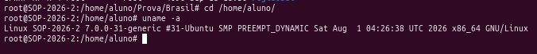

Qual é a versão do kernel em execução?

- **Versão 7, mais especificamente 7.0.0-31-generic**

(b) O comando uptime exibe há quanto tempo o sistema está ativo e a carga média.

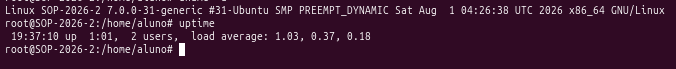

Há quanto tempo o sistema está ligado?
- **1 minuto e 1 segundo**

(c) O comando dmesg | tail mostra as últimas mensagens do kernel, úteis para depuração.

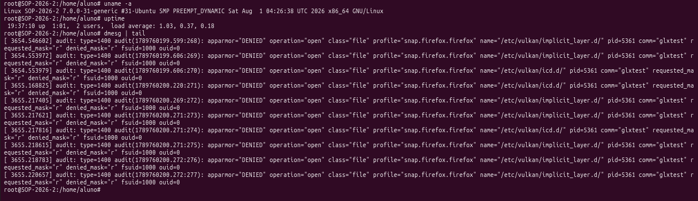

Que tipo de mensagens aparecem no log?

- **Mensagens de audit. Indicando acessos negados pelo apparmor. A operação é de abrir arquivos relacionados ao etc/vulkan. Aparece o process Id também (pid) e o fsuid que corresponde à identidade do usuário**

(d) O comando vmstat exibe estatísticas de memória, processos e CPU.

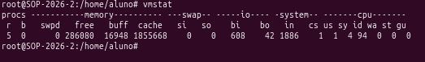

Qual é a quantidade de memória livre?

- **2686080**

(e) O comando iostat mostra estatísticas de entrada/saída de disco.

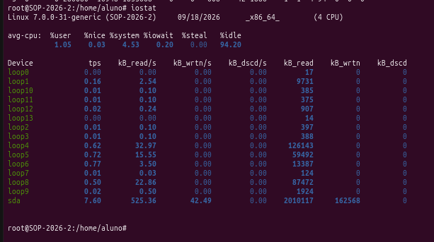

Qual dispositivo apresenta maior atividade de I/O?

- **sda com maiores kb de leitura e escrita**

(f) O comando sar -u 1 3 coleta métricas de desempenho da CPU a cada segundo, por 3

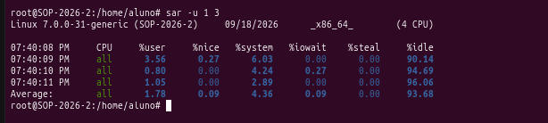

Qual foi o percentual médio de uso da CPU?

- **6,32%**

(g) O comando who mostra usuários logados.

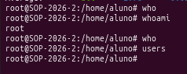

Quantos usuários estão logados?
- **A saída do comando who não ofereceu nenhum retorno. Mas temos o usuário aluno e também o root (veja saida do comando w)**

(h) O comando w mostra usuários e processos em execução.

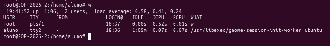

Qual usuário consome mais recursos?
- **O usuário root, o JCPU é maior. JCPU é o tempo consumido por todos os processos não somente o que está rodando agora, não inclui processos terminados em bg, mas inclui processos em bg rodando agora**

(i) O comando id exibe UID, GID e grupos do usuário atual.

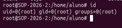

Qual é o UID do seu usuário?

- **0**

(j) O comando lscpu mostra informações da CPU (núcleos, threads, arquitetura).

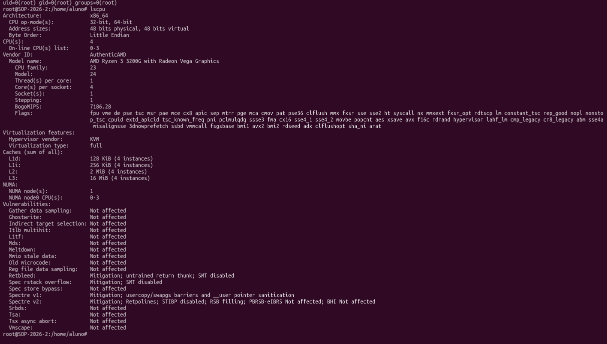

Quantos núcleos físicos e lógicos existem?

- **4 núcleos físicos (CPU) e 4 núcleos lógicos (core per socket)**

(k) O comando cat /proc/cpuinfo mostra detalhes de cada núcleo.

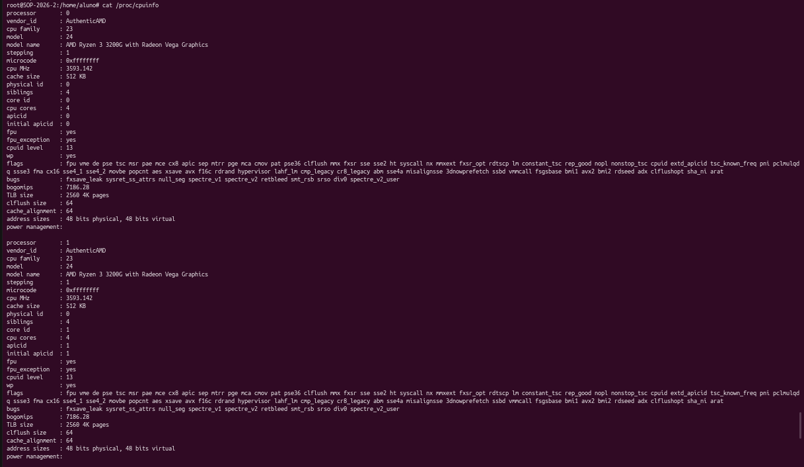
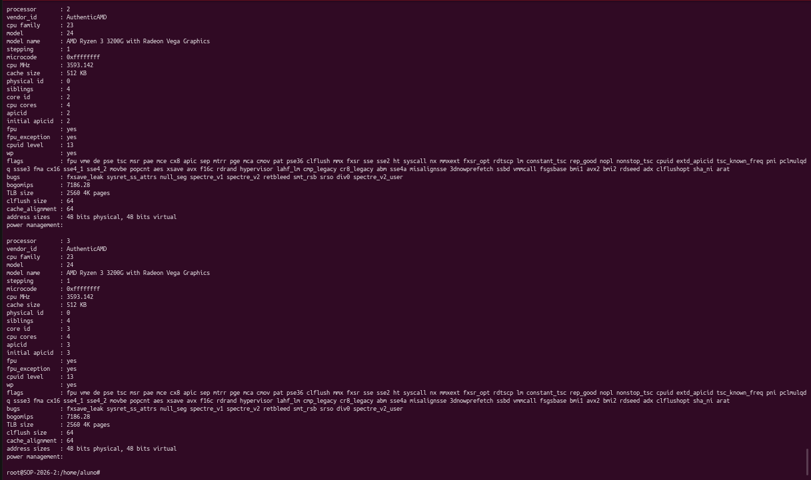

Qual é o modelo da CPU?

- **AMD Ryzen 3 3200G with Radeon Vega Graphics**

(l) O comando nproc retorna a quantidade de núcleos disponíveis.

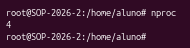

Quantos núcleos o sistema reconhece?

- **4**

(m) O comando free -h mostra memória total, usada e livre.

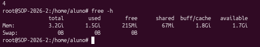

Qual é a quantidade de memória livre?

- **free: 215 MiB**

(n) O comando cat /proc/meminfo mostra informações detalhadas da RAM.

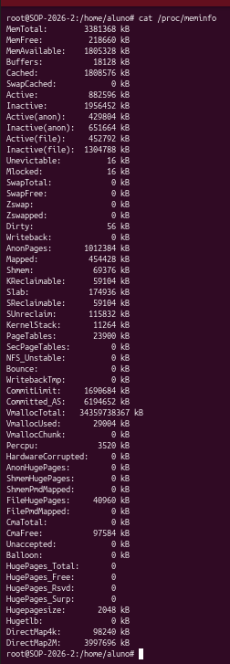

Qual é o valor de MemAvailable?

- **1805328kB**

(o) O comando lsblk lista discos e partições.

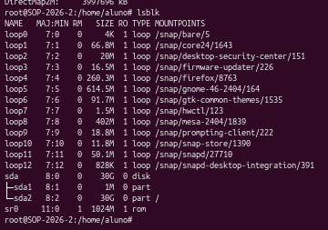

Quais partições estão montadas?

- **Partições reais montadas só o sda2 -> em /**
- **Os loops que qparecem não são partições físicas, mas estão montados em snap/...; aqui seriam 13**

(p) O comando df -h mostra uso de espaço em disco por partição.

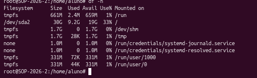

Qual partição está mais cheia?
- **/dev/sda2, com 33% de uso**
