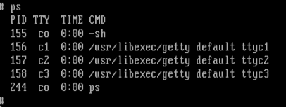
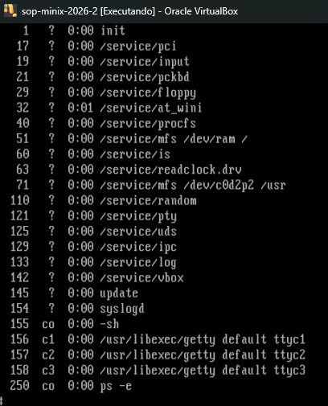
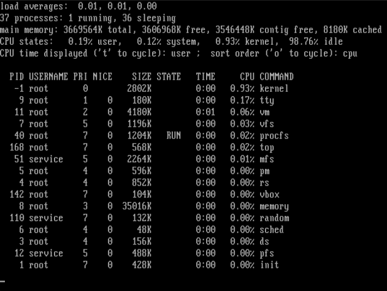

# Atividade

O sistema operacional Minix 3 usa uma arquitetura micronúcleo. Ele pode ser obtido gratuitamente no site http://www.minix3.org. Instale-o em uma máquina virtual e explore seus processos, usando os comandos top e ps.

Acesso o sistema via login e senha: root

Identifique os principais processos em execução, usando a documentação do site e o comando man.

Faça uma lista explicando o que cada um dos serviços faz

---

- **ps**: imprime na tela o status os processos ativos. Se usar o ps -e (ou -ax) é possível ver todos os processos dos terminais e fora deles

    

    

- **top**: imprime na tela de forma dinâmica (em tempo real). Indica um resumo de informações do sistema, lista de processos/threads sendo gerenciadas pelo núcleo

    

É possível ver que há 37 processos, somente em execução (running) e 36 dormindo (sleeping). O comando também mostra um relato da memória e detalhes do processador que está em basicamente ocioso (idle), 98%.

- **kernel**: sempre em primeiro, com o PID -1. É aqui que acontece as operações básicas do sistema

- **init**: inicio de todos os processos, é o primeiro programa que o SO inicia

- **tty**: retorna o nome do terminal do usuário

- **memory**: gerenciamento de memória

- **procfs**: informações sobre processos (/proc). Dá pra ver os processos (diretórios) em ls -la /proc

- **random**: fornece linhas aleatórias de arquivos ou números aleatórios.

- Não encotrados no man: **vfs, mfs**, podem estão relacionados com filesystem; **vm** provavel que estejam relacionados ao gerenciamento da memória virtual; **pm**; **rs**; **sched**; **pfs**; **vbox**