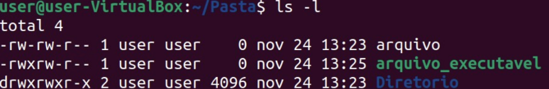

# Usuários e permissionamento

- [x]  [ICO7862 - Lab 5 - Permissionamento.pdf - Google Drive](https://drive.google.com/file/d/1D8gDJBCLsyFnKW9v5gSKmmwrNOfR7-yK/view)

---

### Usuários:

- Dono:
    - Pessoa que criou o arquivo ou diretório
    - Único capaz de modificar as permissões do arquivo
    - Atrelada ao UID (*user ID*)
    - Identificação armazenada em */etc/psswd*
- Grupo:
    - Forma de vários usuários terem acesso a um mesmo arquivo
    - Cada usuário pode fazer parte de um ou mais grupos
    - Por padrão, novo usuário pertence ao grupo de mesmo nome, podendo ser alterado em */etc/adduser.conf*
    - Identificação de grupo: GID (*group ID*)
- Outros:
    - Usuários que não são donos ou não pertencem ao grupo do arquivo
- Usuário *Root*: superusuário, não possui restrições de segurança

---

### Permissões:

Cada conjunto (dono/grupo/outros) pode ter 3 permissões básicas:

| **Tipo de permissão** | **Arquivo** | **Diretório** |
| --- | --- | --- |
| **r** *read* |  *L*er | Listar o conteúdo |
| **w** *write* |  Escrever | write |
| **x** *execute* |  **executar (programa) | acessar |

Permissões são visualizadas com o *ls -l*

**Esquema de permissões (*ls -l*):**

| Posição | Informação | Descrição |
| --- | --- | --- |
|  1 | - , d , l | Tipo de arquivo (comum, diretório, link) |
| 2 a 4 | rwx | Permissões do ***dono*** |
| 5 a 7 | rwx | Permissões do *grupo* |
| 8 a 10 | rwx | Permissões de *outros* |

**Exemplo: -rw-rw-r--** 
tipo de arquivo comum
permissões do dono: read and write
permissões do grupo: read and write
permissões de outros: read

**Exemplo prático:** 

| Permissão | Tipo do arquivo | Dono | Grupo | Outros |
| --- | --- | --- | --- | --- |
| -rw-rw-r-- | comum | read
write | read
write | read |
| lr--r--r-- | link | read | read | read |
| d------rwx | diretório | - | - | read
write
execute |
| -rwxrwxrwx | comum | read
write
execute | read
write
execute | read
write
execute |

**Modo de permissão octal:**

Forma alternativa de representar o esquema de permissões

| **r** | **w** | **x** | **octal** | Permissão |
| --- | --- | --- | --- | --- |
| 0 | 0 | 0 | 0 | Nenhuma permissão |
| 0 | 0 | 1 | 1 | Execução |
| 0 | 1 | 0 | 2 | Escrita |
| 0 | 1 | 1 | 3 | Escrita e execução |
| 1 | 0 | 0 | 4 | Leitura |
| 1 | 0 | 1 | 5 | Leitura e execução |
| 1 | 1 | 0 | 6 | Leitura e escrita |
| 1 | 1 | 1 | 7 | Leitura, escrita e execução |

**Exemplo prático:**

| Permissão | Dono | Grupo | Outros |
| --- | --- | --- | --- |
| 764 | rwx | rw | r |
| 240 | w | r | - |
| 751 | rwx | rx | x |
| 777 | rwx | rwx | rwx |

---

### Comando *chmod [opções] [permissões] [arquivo]*

O *chmod* muda a permissão de acesso a um arquivo ou diretório.

**Opções** interessantes:

- -r  (--recursive)     muda permissões no diretório atual e subdiretórios

Permissões: [ugoa] [+-=] [rwx]

- ugoa                        dono/user (u), grupo (g), outros (o), todos (a)
- +-=                          adiciona (+), retira (-), define (=) a permissão
- rwx                           permissão a ser alterada
- códigos octais (777, 752, 041) podem ser usados

Exemplo prático:

| Comando | Comentário | Alteração |
| --- | --- | --- |
| chmod o-r teste.txt | others retira read teste.txt | Retira (-) a permissão de leitura (r) do arquivo teste.txt para outros usuários |
| chmod a+x teste.txt | all adiciona execute teste.txt | Adiciona (+) a permissão de execução (x) ao arquivo teste.txt para todos os usuários |
| chmod uo+x teste.txt | user and others adiciona execute teste.txt | Adiciona (+) a permissão de execução ao arquivo teste.txt para o dono/user e para outros usuários |
| chmod a=rw teste.txt | all define read and write teste.txt | Define a permissão de todos os usuários exatamente (=) para a leitura e gravação do arquivo texte.txt (substitui as permissões) |
| chmod g+r * | group adiciona read qualquer arquivo | Permite que todos os usuário que pertençam ao grupo dos arquivos (g) tenham (+) permissões de leitura (r) em todos os arquivos do diretórios atual |

**Outros comandos:**

- ***chgrp [opções] [grupo] [arquivo]***
muda o grupo de um arquivo ou diretório
opções interessantes: -r (--recursive) que muda as permissões no diretório atual e subdiretórios
- ***chown [opções] [dono.grupo] [arquivo]***
muda o dono (opcionalmente o grupo) de um arquivo ou diretório
opções interessantes: -r (--recursive) que muda as permissões no diretório atual e subdiretórios